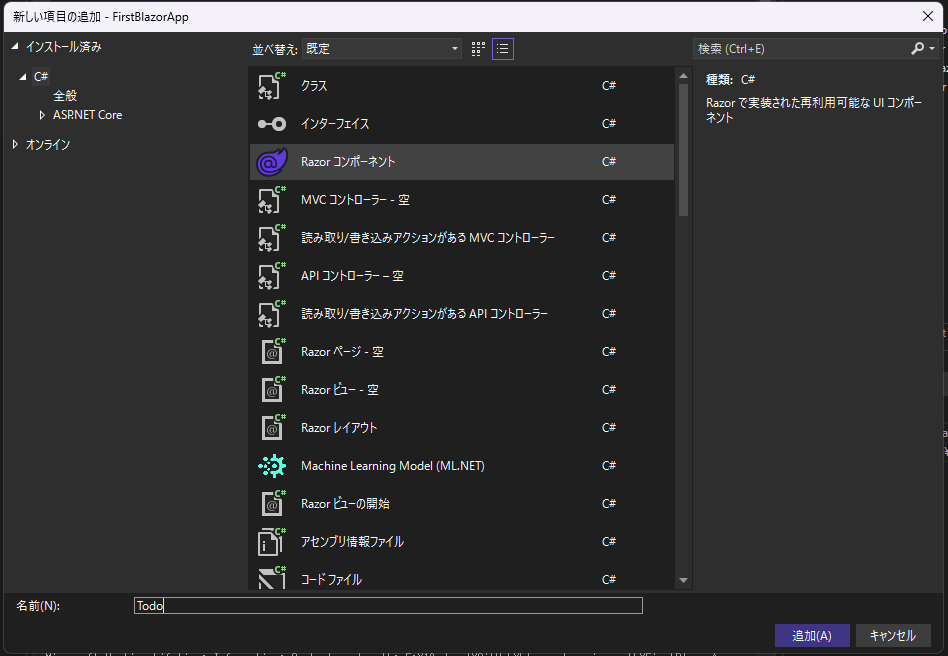
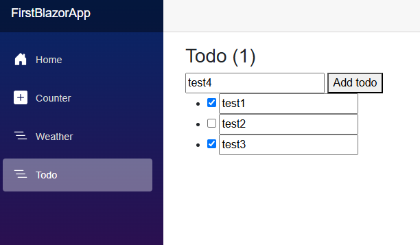

# 学習メモ

## Blazor を使用した Web 開発の概要

### Blazor とは

- HTML, CSS, C#を用いたWebフレームワーク
- .NETの一部
- クロスプラットフォームで動作

#### 利点

- 再利用可能なコンポーネントを仕様してWeb UIをすばやく構築する
  - コンポーネントモデルを採用
- C#で実装できる
  - C#開発者にとって学習コストが低い
- 技術スタックが1つで済む
  - フロントエンドとバックエンドをC#一本でコード共有できる
- 差分ベースレンダリング
  - JS/TSフレームワークで採用される仮想DOMではなく、Render Treeが使用されている
  - UI要素をメモリ上で保持し、変更部分のみをDOMに反映させる仕組み
  - 仮想DOMと比べて初期ロード時間が遅くなる傾向があるらしい
- サーバーとクライアントの両方でレンダリングできる
- JavaScriptとの相互運用
  - C#コードからJSライブラリやブラウザAPIのエコシステムを使用できる

### Blazor のしくみ

- Blazorコンポーネント
  - 再利用可能なWeb UI
  - レンダリングとUIイベント処理をカプセル化
  - 事前構築済みのBlazorコンポーネントが利用可能
- UIイベント処理とデータバインディング
  - C#イベントハンドラを使用してWeb UI操作を処理する
  - コンポーネントの状態とUI要素を双方向バインディングで同期する
  - `@code` ブロックにイベント処理などを記述できる
- レンダリング
  - 既定ではサーバーで静的レンダリングしてHTMLを生成する
  - WebSocketで対話的にUI操作、更新
  - クライアントにWebAssemblyをダウンロードし、クライアントで動作
  - SPA

### Blazorの使い時

- 生産性の高いフルスタックWeb開発
- 既に.NETを使用しており、既存スキルを活用したい
- 高いパフォーマンスとスケーラビリティを備えるバックエンドが必要

適していないケース

- クライアント側の初期ダウンロードサイズと読み込み時間を完全に最適化する必要がある
  - Render Treeの初期読み込みやWASMのダウンロード時間が影響と思われる
- 別のフロントエンドフレームワークエコシステムと密接な統合を行う必要がある
  - フロントエンドはJS、バックエンドはBlazor、とはやりにくいということか
  - APIサーバーにできないこともなさそうだが、あえてBlazorでらなくてもいいFWは他にありそう
- 古いWebブラウザをサポートする必要がある

## Blazor を使って初めての Web アプリを構築する

### 開発環境の構築

- [.NET SDK](https://dotnet.microsoft.com/ja-jp/)のインストール
  - `dotnet new <template-name>` …… 新しいプロジェクトの作成
    - `dotnet new blazor`
  - `dotnet build`, `dotnet run` …… プロジェクトのビルド、実行
  - `dotnet watch` コード変更の自動適用
- Blazorツール
  - [C# Dev Kit](https://marketplace.visualstudio.com/items?itemName=ms-dotnettools.csdevkit) 拡張機能で使用可能

### ウェブアプリを作成、実行

.NET 8.0 SDKを使ってウェブアプリを作成する。  
ターミナルで `dotnet --list-sdks` コマンドを実行し、SDKがインストールされているか確認する。

```cmd
> dotnet --list-sdks
8.0.404 [C:\Program Files\dotnet\sdk]
```

Ctrl + Shift + P キーでコマンドパレットを表示し、「.NET: 新しいプロジェクト」を選択する。`.net new project` で検索可能。


Blazor Web アプリを選択し、プロジェクト名、フォルダを作成するフォルダを選択する。


- `Program.cs` …… エントリーポイント。サービスとミドルウェアを構成する
- `App.razor` …… アプリのルートコンポーネント
- `Routes.razor` …… Blazorルーター
- `Components/Pages` …… アプリのWebページ
- `FirstBlazorApp.csproj` …… プロジェクトファイル
- `Properties/launchSettings.json` …… ローカル開発環境のプロファイル設定

その後、VSCodeでデバッグをしようと試みたが、うまく出来なかった。  
より具体的には、ビルドや実行は出来たが、デバッガを使ってブレークポイントで止める、ということが出来なかった。

VSCodeの適切なデバッガ選択や launch.json が不明。

仕方ないので、Visual Studioに切り替えて実施する。

新規プロジェクトで Blazor Web App を選択する。


プロジェクト名を入力し、追加情報を設定して作成する。


デバッグを開始した後、火のアイコンをアクティブにするとホットリロードを有効にできる。  
「ファイル保存時のホットリロード」を有効にしないとリロードされない？


### Razor コンポーネント

Razor とは

- HTML と C# に基づいたマークアップ構文
- プレーンな HTML と C# のロジックを含む
- Razor ファイルは、コンポーネントのrんだリングロジックをカプセル化する C# クラスにコンパイルされる

Razor コンポーネントとは

- レンダリングする HTML およびユーザーイベントの処理方法を再利用可能なコンポーネントとして定義する
- Razor で作成された Blazor コンポーネントは単なるC#クラスなので、任意の.NETコードを使用できる
- コンポーネント名と一致するHTMLスタイルタグを使用することで、コンポーネントを使用できる
- パラメータはpublicな `[Parameter]` 属性を持つプロパティをコンポーネントに追加することで定義し、プロパティ名に一致するHTMLスタイル属性で値を指定する
- `@page` ディレクティブでページのルートを指定する
- `@code` ブロックでC#クラスメンバーをコンポーネントに追加する
- `@rendermode InteractiveServer` ディレクトリ部を宣言すると、ブラウザからのUIイベントをサーバーが処理できるようになる
  - モードは None, Server, WebAssembly, Auto(Server and WebAssembly) が選択できる

## Blazor を使用して To Do リストを作成する

### データバインディングとイベント

データバインディングやUIイベントを処理するためには、コンポーネントが対話型である必要がある。  
`@rendermode` ディレクティブで対話型レンダリングモードを適用する。

- C# 式の値をレンダリングする場合、先頭に `@` 文字をつける
  - `( )` を使用して式の開始と終了を明示的に指定することもできる
- 制御フローを追加する場合も先頭に `@` 文字をつける

```
@if (currentCount > 3)
{
    <p>You win!</p>
}
```

```
<ul>
    @foreach (var item in items)
    {
        <li>@item.Name</li>
    }
</ul>
```

- UIイベントのコールバックは `@on` で始まり、イベント名で終わる属性を使用する
  - `@onclick` 属性でボタンクリックイベント
  - `@onchange` , `@oninput` など
  - メソッド名を指定する他、ラムダ式をインラインで定義することもできる
- UI要素の値をコード内の特定の値にバインドするには、 `@bind` 属性を使用する
  - `@` で指定する場合と比較し、ユーザー入力等のUI側での変更をC#コードで同期できる
  - 追加の修飾子を使用できる
    - `@bind:get` や `@bind:set` では値の取得、設定時のコールバックを指定できる
    - `@bind:after` 値が更新された後のコールバックを指定できる

### Todoリストを作成する

Razorコンポーネントを追加。



.NET CLIで実行する場合;

```cmd
dotnet new razorcomponent -n Todo -o Components/Pages
```

`@page` ディレクティブと `@rendermode` ディレクティブを追加する。

```
@page "/todo"
@rendermode InteractiveServer

<h3>Todo</h3>

@code {

}
```

`Layout/NavMenu.razor` を編集し、ナビゲーションメニューにページリンクを追加

```
<div class="nav-scrollable" onclick="document.querySelector('.navbar-toggler').click()">
    <nav class="flex-column">
...
        <div class="nav-item px-3">
            <NavLink class="nav-link" href="todo">
                <span class="bi bi-list-nested-nav-menu" aria-hidden="true"></span> Todo
            </NavLink>
        </div>
    </nav>
</div>
```

テキストエリアとボタンを配置し、 文字列フィールドと `@onclick` イベントのバインドを設定してTodoを追加できるようにする。

```
@page "/todo"
@rendermode InteractiveServer

<h3>Todo</h3>

<input @bind="newTodo" />
<button @onclick="AddTodo">Add todo</button>

<ul>
    @foreach (var todo in todos)
    {
        <li>@todo.Title</li>
    }
</ul>

@code {
    private List<TodoItem> todos = new();

    string newTodo = string.Empty;
    private void AddTodo()
    {
        if (!string.IsNullOrWhiteSpace(newTodo))
        {
            todos.Add(new TodoItem { Title = newTodo });
            newTodo = string.Empty;
        }
    }
}
```

チェックボックスを追加する

```
@page "/todo"
@rendermode InteractiveServer

<h3>Todo (@todos.Count(todo => !todo.IsDone))</h3>

<input @bind="newTodo" />
<button @onclick="AddTodo">Add todo</button>

<ul>
    @foreach (var todo in todos)
    {
        <li>
            <input type="checkbox" @bind="todo.IsDone" />
            <input @bind=todo.Title />
        </li>
    }
</ul>

@code {
    private List<TodoItem> todos = new();

    string newTodo = string.Empty;
    private void AddTodo()
    {
        if (!string.IsNullOrWhiteSpace(newTodo))
        {
            todos.Add(new TodoItem { Title = newTodo });
            newTodo = string.Empty;
        }
    }
}
```



## Blazor Web アプリでデータを操作する

### サービスの定義

データソースからUIに表示するデータを取得するサービスを定義する。

Blazorで使用できるデータソースには、RDS、NoSQL、Webサービス、Azureサービス、その他多くのシステムが含まれる。  
Entitiy Framework、HTTPクライアント、ODBCなどの.NET技術を用いてそれらのソースに対してクエリを実行できる。

まず、取得するデータを表現するためのクラスを定義する。データに関するクラスなので `Data` というメンバー名前空間を割り当てる。

```cs
namespace BlazingPizza.Data;

public class Pizza
{
    public int PizzaId { get; set; }
    public string Name { get; set; }
    public string Description { get; set; }
    public decimal Price { get; set; }
    public bool Vegetarian { get; set; }
    public bool Vegan { get; set; }
}
```

次に、データを取得するサービスを定義する。

```cs
namespace BlazingPizza.Data;

public class PizzaService
{
    public Task<Pizza[]> GetPizzasAsync()
    {
      // データアクセス
    }
}
```

データソースへのアクセスには通常時間がかかる可能性があるため非同期呼び出しを使用し、データクラスのコレクションを取得する。

最後に、 `Program.cs` にコードを追加し、サービスを登録する。  

```cs
...
// ピザサービスを追加
builder.Services.AddSingleton<PizzaService>();
...
```

これは依存性注入という仕組みで、依存先のクラスのインスタンスをインターフェースを経由して参照することで疎結合になるようにする。  
BlazorのDIでは、インスタンスの有効な範囲が決められる。

- Transient …… コンポーネントがアクセスされる度にインスタンスを生成する
- Scoped …… 利用ユーザー単位でインスタンスを生成する。コンポーネント間で共通のインスタンスが利用される
- Singleton …… アプリケーション全体でインスタンスが生成される。
  - Blazor Serverの場合、アプリケーションプロセスはサーバー側なので、ユーザー間でも共通のインスタンスが利用される
  - Blazor WebAssemblyの場合、アプリケーションプロセスはクライアント側なので、Scopedと同じ動作になる

今の例では全てのユーザーに共通する商品情報なので、Singletonスコープで登録できる。

参考：[BlazorにおけるDIのScopeについて](https://zenn.dev/yoshi1220/articles/22b99b1e3717e3)

サービスを呼び出すためにはDIでインスタンスを取得する。後ろにコンポーネント内で使用するサービスのインスタンス名をつけられる。

```cs
@using BlazingPizza.Data
@inject PizzaService PizzaSvc
```

サービスからデータを取得する場合、 `OnInitializedAsync` メソッドで実行するのが適切らしい。  
これは、コンポーネントの初期化が完了し、初期パラメータを受け取った後、ページがレンダリングされる前に発生する。

このイベントをオーバーライドしてデータを取得する。非同期呼び出しなので `await` キーワードを使用する。

```cs
private Pizza[] todaysPizzas;

protected override async Task OnInitializedAsync()
{
  todaysPizzas = await PizzaSvc.GetPizzaAsync();
}
```

### データベースアクセス

NuGetパッケージの `Microsoft.EntityFrameworkCore` をインストールする。  
さらに、アクセスするデータベースに合わせて追加のパッケージをインストールする。  
SQLiteを利用する場合は `Microsoft.EntityFrameworkCore.Sqlite` 。

エンティティに相当するデータクラスがあり、これによる `DbSet<T>` 型のプロパティに持つデータベースコンテキストを定義する。  
プロパティ名がテーブル名になる。  
データベースコンテキストを通じてデータの取得、挿入、更新などを行う。

```cs
using Microsoft.EntityFrameworkCore;

namespace BlazingPizza.Data;

public class PizzaStoreContext : DbContext
{
    public PizzaStoreContext(DbContextOptions options) : base(options)
    {
    }

    public DbSet<PizzaSpecial> Specials { get; set; }
}
```

データベースコンテキストを利用するために、 `Program.cs` にサービスを追加する。

```cs
builder.Services.AddSqlite<PizzaStoreContext>("Data Source=pizza.db");
```

例えば初期シードとしてデータを挿入する場合は `Specials.AddRange` でデータを追加して `SaveChanges` メソッドでコミットする。

```cs
namespace BlazingPizza.Data;

public static class SeedData
{
    public static void Initialize(PizzaStoreContext db)
    {
        var specials = new PizzaSpecial[]
        {
            new PizzaSpecial()
            {
                Name = "Basic Cheese Pizza",
                Description = "It's cheesy and delicious. Why wouldn't you want one?",
                BasePrice = 9.99m,
                ImageUrl = "img/pizzas/cheese.jpg",
            },
        };
        db.Specials.AddRange(specials);
        db.SaveChanges();
    }
}
```

データベースコンテキストを直接利用すると、そのインスタンスが長時間利用されることによる競合やデータ不整合が発生する可能性がある。  
この問題を解決するため、データベーススコープを利用して必要なときに新しいデータベーススコープを作成して使用後に破棄できるようにする。

```cs
var scopeFactory = app.Services.GetRequiredService<IServiceScopeFactory>();
using (var scope = scopeFactory.CreateScope())
{
    var db = scope.ServiceProvider.GetRequiredService<PizzaStoreContext>();
    // データベースコンテキストの利用
}
```

参考：[[初心者][備忘録]Blazor Server におけるDbContextの使い方 #Blazor - Qiita](https://qiita.com/minoura_a/items/0de89502d437368bafa8)

### コンポーネント間のデータ共有

- コンポーネントパラメータ、カスケード型パラメータ
  - 親コンポーネントから子コンポーネントに値を送信する
- AppState パターン
  - アプリケーションの任意のコンポーネントからアクセスできる

#### コンポーネントパラメータ

子コンポーネントに子コンポーネントパラメータをパブリックプロパティとして定義し、 `[Parameter]` 属性で修飾する

```cs
<h2>New Pizza: @PizzaName</h2>

<p>@PizzaDescription</p>

@code {
    [Parameter]
    public string PizzaName { get; set; }
    
    [Parameter]
    public string PizzaDescription { get; set; } = "The best pizza you've ever tasted."
}
```

カスタムクラスをパラメータに設定する場合、親コンポーネントではインラインコードなどでインスタンスを渡すことで値を送信できる。

```cs
<h2>New Topping: @Topping.Name</h2>

<p>Ingredients: @Topping.Ingredients</p>

@code {
    [Parameter]
    public PizzaTopping Topping { get; set; }
}
```

```cs
@page "/pizzas-toppings"

<h1>Our Latest Pizzas and Topping</h1>

<Pizza PizzaName="Hawaiian" PizzaDescription="The one with pineapple" />

<PizzaTopping Topping="@(new PizzaTopping() { Name = "Chilli Sauce", Ingredients = "Three kinds of chilli." })" />
```

#### カスケード型パラメータ

直接の親子関係にあるコンポーネントではなく、より深い階層にパラメータを自動送信する場合、カスケード型のパラメータとして親コンポーネントに値を設定すると、任意の深さの全ての子孫コンポーネントで使用できるようになる。

具体的には、 `<CascadingValue>` タグで指定した情報がそのタグ内でレンダリングされる全てのコンポーネントで参照できる。  

```cs
@page "/specialoffers"

<h1>Special Offers</h1>

<CascadingValue Name="DealName" Value="Throwback Thursday">
    <!-- Any descendant component rendered here will be able to access the cascading value. -->
</CascadingValue>
```

参照するコンポーネントでは、プロパティで `[CascadingParameter]` 属性で修飾する。  
`Name` 値を省略した場合、属性は型によって照合される。その型のパラメータが1つならばよいが、2つ以上定義している場合は `Name` 値を指定する必要がある。  

```cs
<h2>Deal: @DealName</h2>

@code {
    [CascadingParameter(Name="DealName")]
    private string DealName { get; set; }
}
```

#### AppState パターン

格納するプロパティをクラスとして定義し、値を設定または使用するためのスコープ付きサービスとして登録する。

値を格納するクラス

```cs
public class PizzaSalesState
{
    public int PizzasSoldToday { get; set; }
}
```

`Program.cs` で（セッション中で有効にするなら）スコープ付きサービスとして追加する。  
アプリケーション全体で有効にしたい場合は Singleton スコープにするなど。

```cs
builder.Services.AddScoped<PizzaSalesState>();
```

`@inject` でサービスをDIして参照する。

```cs
@page "/"
@inject PizzaSalesState SalesState

<h1>Welcome to Blazing Pizzas</h1>

<p>Today, we've sold this many pizzas: @SalesState.PizzasSoldToday</p>

<button @onclick="IncrementSales">Buy a Pizza</button>

@code {
    private void IncrementSales()
    {
        SalesState.PizzasSoldToday++;
    }
}
```

### データバインディング

UI要素をプロパティに関連付ける。

バインドするときの属性や変更通知イベントはHTML要素ごとにいい感じの対象が選択される。  
例えば、テキストエリア `<input>` では `value` 属性がバインドされ、チェックボックス `<checkbox>` では `checked` 属性がバインドされる。  
また、いずれも `onchanged` イベンドにコントロールがバインドされる。

バインドする属性やイベントを指定したい場合、それぞれ `@bind-value` ディレクティブと `@bind-value:event` ディレクティブを指定する。  
例えば、値の変更時ではなく入力時であれば、 `@bind-value:event="oninput"` など。

バインドする値に書式を指定したい場合、 `@bind:format` ディレクティブを設定する。  
ただし、使用できるのは日付のみで、日付書式文字列を指定できる。  

日付以外で書式を指定したい場合は、`get` アクセサで書式付きの値を返すようにするとできる。

```cs
@page "/pizzaapproval"
@using System.Globalization

<h1>Pizza: @PizzaName</h1>

<p>Approval rating: @approvalRating</p>

<p>
    <label>
        Set a new approval rating:
        <input @bind="ApprovalRating" />
    </label>
</p>

@code {
    private decimal approvalRating = 1.0;
    private NumberStyles style = NumberStyles.AllowDecimalPoint | NumberStyles.AllowLeadingSign;
    private CultureInfo culture = CultureInfo.CreateSpecificCulture("en-US");
    
    private string ApprovalRating
    {
        get => approvalRating.ToString("0.000", culture);
        set
        {
            if (Decimal.TryParse(value, style, culture, out var number))
            {
                approvalRating = Math.Round(number, 3);
            }
        }
    }
}
```

`ApprovalRating.set` によって値が更新されたときに `ApprovalRating.get` の値も変わるので間接的に `<input>` の値が変わる。  
このとき、直接変更したプロパティのみが変化するのではなくコンポーネント全体を再レンダリングし、DOMの差分を適用する流れで実施されるらしい。  
なので、WPFみたいな `ApprovalRating.set` の中で明示的に変更される `approvalRating` プロパティだけが差分通知される、とかではないらしい。

[非同期なHTMLのレンダリングもサーバ側から全部やっちゃう「Blazor Server」が凄すぎる #C# - Qiita](https://qiita.com/jun1s/items/c0c872fb7cefbdc7f26e)

## ページ、ルーティング、レイアウトを使用して Blazor のナビゲーションを改善する

### ルートテンプレート

- `App.razor` で定義する `Router` コンポーネントで要求をルーティングする。
- `<Found>` タグで一致するルートがある場合のレスポンスを定義できる
- `<NotFound>` タグで一致するルートがない場合のレスポンスを定義できる

### NavigationManager

`Navigationmanager` オブジェクトを取得し、以下の情報にアクセスできる

- 現在の完全な URI (http://www.contoso.com/pizzas/margherita?extratopping=pineapple など)。
- ベース URI (http://www.contoso.com/ など)。
- ベース相対パス (pizzas/margherita など)。
- クエリ文字列 (?extratopping=pineapple など)。

```cs
@page "/pizzas"
@using Microsoft.AspNetCore.WebUtilities
@inject NavigationManager NavManager

<h1>Buy a Pizza</h1>
<p>I want to order a: @PizzaName</p>
<p>I want to add this topping: @ToppingName</p>

@code {
    [Parameter]
    public string PizzaName { get; set; }
    private string ToppingName { get; set; }
    public string HomePageURI { get; set; }
    protected override void OnInitialized()
    {
      // ベースURI
      HomePageURI = NavManager.BaseUri;
      // 完全なURI
      var uri = NavManager.ToAbsoluteUri(NavManager.Uri);
      // クエリ文字列の解析
      if (QueryHelpers.ParseQuery(uri.Query).TryGetValue("extratopping", out var extraTopping))
      {
        ToppingName = System.Convert.ToString(extraTopping);
      }
    }
}
```

別のコンポーネントに転送するには、 `NavManager.NavigationTo()` メソッドを呼び出す。引数では絶対URまたは相対URIを指定する。

### ルートパラメータ

`@page` ディレクティブでルートパラメータの値を取得できるように定義する。  
Blazorでは、パラメータとプロパティの大文字小文字は区別しない。

```cs
@page "/FavoritePizzas/{favorite}"

<h1>Choose a Pizza</h1>
<p>Your favorite pizza is: @Favorite</p>

@code {
    [Parameter]
    public string Favorite { get; set; }
}
```

- `{favorite?}` とすると、パラメータは省略可能となる。
- `{favorite:int}` のようにすると、パラメータの型を指定できる。
- `{*favorites}` のようにすると、全てのルートパラメータを取得できる。

### Blazor レイアウト

レンダリングされたマークアップを、それを参照する全てのコンポーネントと共有する仕組み。  
ナビゲーションメニュー、ヘッダーフッターなどの共通UI要素を定義する。

Blazor レイアウトのコンポーネントは `LayoutComponentBase` クラスを継承し、 `@Body` ディレクティブで参照コンポーネントのレンダリング場所を指定する。  
他から参照されるコンポーネントなので、 `@page` ディレクティブは含めない。

```cs
// クラスの継承
@inherits LayoutComponentBase

<header>
    <h1>Blazing Pizza</h1>
</header>

<nav>
    <a href="Pizzas">Browse Pizzas</a>
    <a href="Toppings">Browse Extra Toppings</a>
    <a href="FavoritePizzas">Tell us your favorite</a>
    <a href="Orders">Track Your Order</a>
</nav>

// レンダリング場所
@Body

<footer>
    @new MarkdownString(TrademarkMessage)
</footer>

@code {
    public string TrademarkMessage { get; set; } = "All content is &copy; Blazing Pizzas 2021";
}
```

Blazor レイアウトコンポーネントを使う側では `@layout` ディレクティブを追加する。  
ファイル名を `_Imports.razor` とすると、フォルダー内の全てのコンポーネントに対して自動的に適用される。

```cs
@page "/FavoritePizzas/{favorite}"
@layout BlazingPizzasMainLayout

<h1>Choose a Pizza</h1>

<p>Your favorite pizza is: @Favorite</p>

@code {
    [Parameter]
    public string Favorite { get; set; }
}
```
