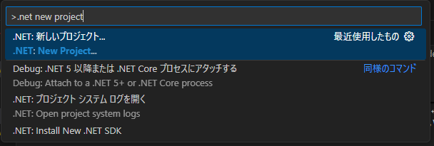
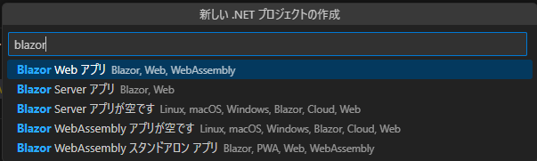
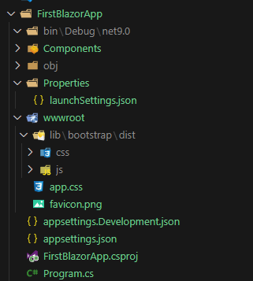
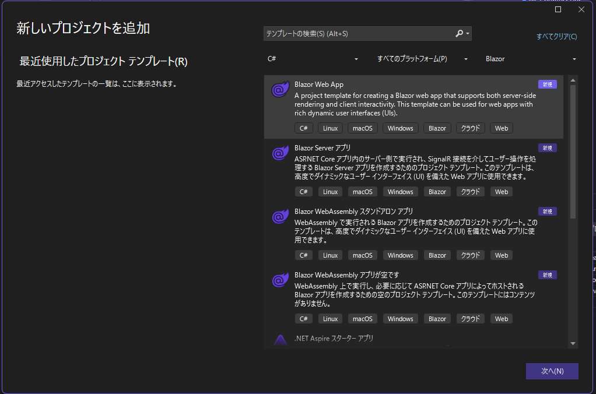
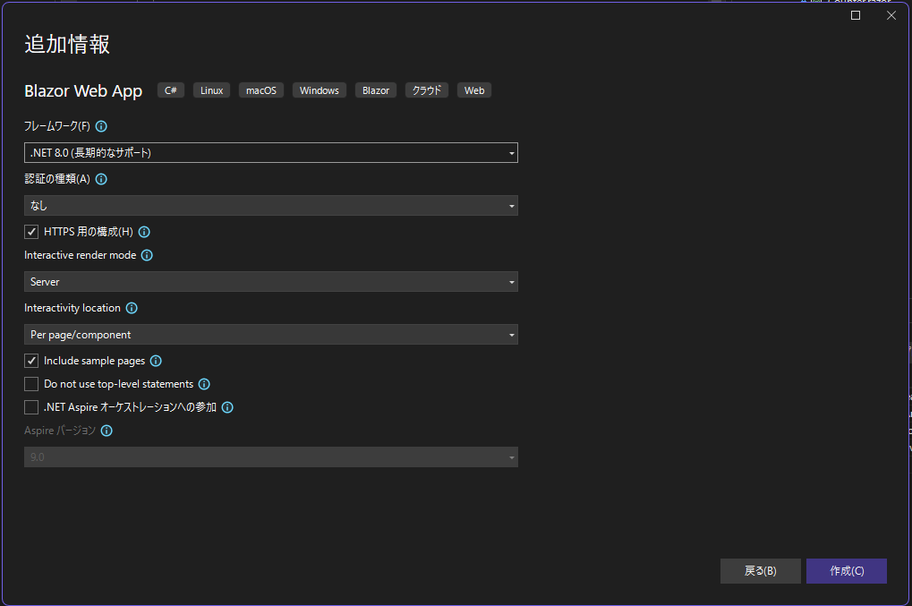
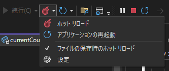

# 学習メモ

## Blazor を使用した Web 開発の概要

### Blazor とは

- HTML, CSS, C#を用いたWebフレームワーク
- .NETの一部
- クロスプラットフォームで動作

#### 利点

- 再利用可能なコンポーネントを仕様してWeb UIをすばやく構築する
  - コンポーネントモデルを採用
- C#で実装できる
  - C#開発者にとって学習コストが低い
- 技術スタックが1つで済む
  - フロントエンドとバックエンドをC#一本でコード共有できる
- 差分ベースレンダリング
  - JS/TSフレームワークで採用される仮想DOMではなく、Render Treeが使用されている
  - UI要素をメモリ上で保持し、変更部分のみをDOMに反映させる仕組み
  - 仮想DOMと比べて初期ロード時間が遅くなる傾向があるらしい
- サーバーとクライアントの両方でレンダリングできる
- JavaScriptとの相互運用
  - C#コードからJSライブラリやブラウザAPIのエコシステムを使用できる

### Blazor のしくみ

- Blazorコンポーネント
  - 再利用可能なWeb UI
  - レンダリングとUIイベント処理をカプセル化
  - 事前構築済みのBlazorコンポーネントが利用可能
- UIイベント処理とデータバインディング
  - C#イベントハンドラを使用してWeb UI操作を処理する
  - コンポーネントの状態とUI要素を双方向バインディングで同期する
  - `@code` ブロックにイベント処理などを記述できる
- レンダリング
  - 既定ではサーバーで静的レンダリングしてHTMLを生成する
  - WebSocketで対話的にUI操作、更新
  - クライアントにWebAssemblyをダウンロードし、クライアントで動作
  - SPA

### Blazorの使い時

- 生産性の高いフルスタックWeb開発
- 既に.NETを使用しており、既存スキルを活用したい
- 高いパフォーマンスとスケーラビリティを備えるバックエンドが必要

適していないケース

- クライアント側の初期ダウンロードサイズと読み込み時間を完全に最適化する必要がある
  - Render Treeの初期読み込みやWASMのダウンロード時間が影響と思われる
- 別のフロントエンドフレームワークエコシステムと密接な統合を行う必要がある
  - フロントエンドはJS、バックエンドはBlazor、とはやりにくいということか
  - APIサーバーにできないこともなさそうだが、あえてBlazorでらなくてもいいFWは他にありそう
- 古いWebブラウザをサポートする必要がある

## Blazor を使って初めての Web アプリを構築する

### 開発環境の構築

- [.NET SDK](https://dotnet.microsoft.com/ja-jp/)のインストール
  - `dotnet new <template-name>` …… 新しいプロジェクトの作成
    - `dotnet new blazor`
  - `dotnet build`, `dotnet run` …… プロジェクトのビルド、実行
  - `dotnet watch` コード変更の自動適用
- Blazorツール
  - [C# Dev Kit](https://marketplace.visualstudio.com/items?itemName=ms-dotnettools.csdevkit) 拡張機能で使用可能

### ウェブアプリを作成、実行

.NET 8.0 SDKを使ってウェブアプリを作成する。  
ターミナルで `dotnet --list-sdks` コマンドを実行し、SDKがインストールされているか確認する。

```cmd
> dotnet --list-sdks
8.0.404 [C:\Program Files\dotnet\sdk]
```

Ctrl + Shift + P キーでコマンドパレットを表示し、「.NET: 新しいプロジェクト」を選択する。`.net new project` で検索可能。



Blazor Web アプリを選択し、プロジェクト名、フォルダを作成するフォルダを選択する。





- `Program.cs` …… エントリーポイント。サービスとミドルウェアを構成する
- `App.razor` …… アプリのルートコンポーネント
- `Routes.razor` …… Blazorルーター
- `Components/Pages` …… アプリのWebページ
- `FirstBlazorApp.csproj` …… プロジェクトファイル
- `Properties/launchSettings.json` …… ローカル開発環境のプロファイル設定

その後、VSCodeでデバッグをしようと試みたが、うまく出来なかった。  
より具体的には、ビルドや実行は出来たが、デバッガを使ってブレークポイントで止める、ということが出来なかった。

VSCodeの適切なデバッガ選択や launch.json が不明。

仕方ないので、Visual Studioに切り替えて実施する。

新規プロジェクトで Blazor Web App を選択する。



プロジェクト名を入力し、追加情報を設定して作成する。



デバッグを開始した後、火のアイコンをアクティブにするとホットリロードを有効にできる。  
「ファイル保存時のホットリロード」を有効にしないとリロードされない？



### Razor コンポーネント

Razor とは

- HTML と C# に基づいたマークアップ構文
- プレーンな HTML と C# のロジックを含む
- Razor ファイルは、コンポーネントのrんだリングロジックをカプセル化する C# クラスにコンパイルされる

Razor コンポーネントとは

- レンダリングする HTML およびユーザーイベントの処理方法を再利用可能なコンポーネントとして定義する
- Razor で作成された Blazor コンポーネントは単なるC#クラスなので、任意の.NETコードを使用できる
- コンポーネント名と一致するHTMLスタイルタグを使用することで、コンポーネントを使用できる
- パラメータはpublicな `[Parameter]` 属性を持つプロパティをコンポーネントに追加することで定義し、プロパティ名に一致するHTMLスタイル属性で値を指定する
- `@page` ディレクティブでページのルートを指定する
- `@code` ブロックでC#クラスメンバーをコンポーネントに追加する
- `@rendermode InteractiveServer` ディレクトリ部を宣言すると、ブラウザからのUIイベントをサーバーが処理できるようになる
  - モードは None, Server, WebAssembly, Auto(Server and WebAssembly) が選択できる
